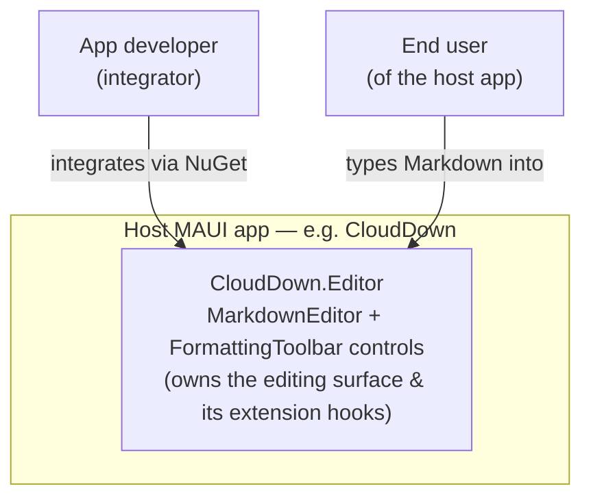
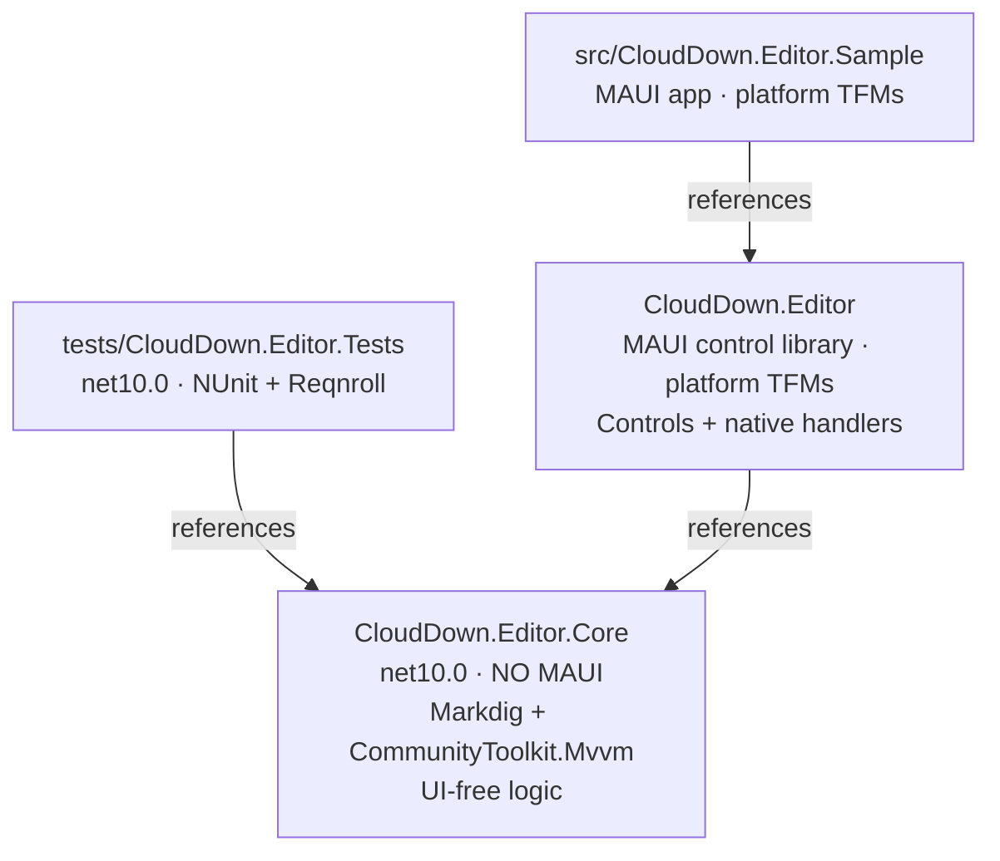
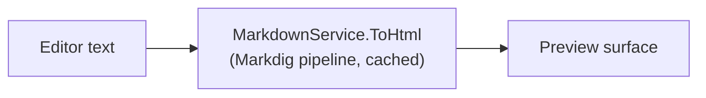
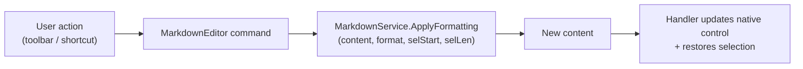

# CloudDown.Editor — Architecture Overview

|                  |                                                                          |
| ---------------- | ------------------------------------------------------------------------ |
| **Status**       | Draft                                                                    |
| **Owner**        | Brian Cupples                                                            |
| **Last updated** | 2026-06-08                                                               |
| **Related**      | [Vision & Scope](../vision.md) · [ADRs](adr/) · [Roadmap](../roadmap.md) |

> A lean (C4/arc42-flavored) map of how CloudDown.Editor is structured and why. It ties the
> [Architecture Decision Records](adr/) together and explains the dependency rules that keep
> the library testable and native. For the rationale behind a specific choice, follow the ADR
> link; this document is the map, the ADRs are the decisions.

Throughout, **(implemented)** marks what exists today and **(planned)** marks designed-but-not-
yet-built structure, so the doc stays honest about the current state.

---

## 1. System Context

CloudDown.Editor is a **library**, not an application. It runs _inside_ a host .NET MAUI app.

The library owns the **editing surface and its extension points**; the host owns everything
above that line (see the "provide the hook, not the feature" principle in the
[vision](../vision.md)).

## 2. Building Blocks (projects)

Four projects; the dependency direction is the important part.

| Project                     | TFM(s)                                    | Depends on                                              | Contains                                                                            |
| --------------------------- | ----------------------------------------- | ------------------------------------------------------- | ----------------------------------------------------------------------------------- |
| **CloudDown.Editor.Core**   | `net10.0`                                 | Markdig, CommunityToolkit.Mvvm, Microsoft.Maui.Graphics | Models, Markdown services, ViewModels — **no MAUI Controls** _(partly implemented)_ |
| **CloudDown.Editor**        | `net10.0-android/ios/maccatalyst/windows` | Microsoft.Maui.Controls, **Core**                       | Controls, native handlers, host-builder extension _(partly implemented)_            |
| **CloudDown.Editor.Sample** | platform TFMs                             | CloudDown.Editor                                        | Demonstrates usage _(implemented)_                                                  |
| **CloudDown.Editor.Tests**  | `net10.0`                                 | **Core**                                                | NUnit + Reqnroll specs — no MAUI _(implemented)_                                    |

**The dependency rule** ([ADR-0003](adr/0003-separate-core-project.md)): logic flows **down**
into Core; UI lives **up** in the MAUI library. Core has no compile-time knowledge of
`Microsoft.Maui.Controls`, so the boundary is enforced by the compiler. Core _may_ use
**`Microsoft.Maui.Graphics`** primitives (e.g. `Color`) as data ([ADR-0005](adr/0005-core-may-depend-on-maui-graphics.md)).
_Where does a new type go? Data/logic → Core; anything that renders or derives from
`Microsoft.Maui.Controls` → the MAUI library._

## 3. Key Components

### Core (`net10.0`)

- **Models** _(implemented)_ — `EditorMode`, `EditorThemeMode`, `MarkdownFormat`; the
  `EditorTheme` / `SyntaxColors` visual-theme model (`Microsoft.Maui.Graphics.Color`).
- **`IMarkdownService` / `MarkdownService`** _(implemented)_ — Markdig-backed rendering
  (`ToHtml`) and selection formatting (`ApplyFormatting`). The UI-free heart of the library.
- **ViewModels** _(planned)_ — `ObservableObject`-based state for editor/toolbar.
- **Decoration / annotation model** _(planned)_ — range-based decoration types that back the
  host-driven extension hooks (e.g. spell-check squiggles). Data only; rendering is in handlers.

### MAUI library (platform TFMs)

- **`MarkdownEditor`** _(planned)_ — the cross-platform control (`View`) with bindable
  `Content`, `Mode`, `Theme`, etc.; the public API surface.
- **`FormattingToolbar`** _(planned)_ — formatting actions bound to a target editor.
- **Platform handlers** _(planned)_ — map the control to native text controls (§4).
- **`ConfigureCloudDownEditor`** _(implemented)_ — host-builder extension that registers
  services (and, later, handlers) into DI.

## 4. The Handler Model

The cross-platform `MarkdownEditor` is a thin control; the real editing experience is delivered
by a **native handler per platform** ([ADR-0001](adr/0001-native-controls-no-webview.md)) — no
WebView.

| Platform     | Native control | Rich text mechanism       |
| ------------ | -------------- | ------------------------- |
| Android      | `EditText`     | `SpannableString` + spans |
| iOS          | `UITextView`   | `NSAttributedString`      |
| Mac Catalyst | `NSTextView`   | attributed strings        |
| Windows      | `RichEditBox`  | document/range formatting |

The handler translates between the control's cross-platform API (Markdown text, selection,
formatting commands, decorations) and the native control's text/attribute model. Behavior
parity across these four implementations is the main architectural risk, mitigated by the
shared Reqnroll behavior specs ([ADR-0002](adr/0002-test-stack.md)).

## 5. Key Flows

**Rendering (preview / Split mode):**

**Applying formatting (toolbar or shortcut):**

Keeping `ApplyFormatting` in Core (pure, UI-free) is what lets the behavior be specified and
tested without a device.

## 6. Cross-Cutting Concerns

- **Performance** _(planned mechanisms)_ — incremental/cached Markdown parsing, debounced
  syntax highlighting, and virtualization for large documents (see vision success criteria).
- **Accessibility** — inherited from native controls; a primary reason for the no-WebView
  decision.
- **Threading** — editing/UI on the platform UI thread; heavier parsing may move off-thread
  for large documents (to be designed alongside the handlers).
- **Reliability** — never corrupt or lose user content; formatting transforms are total and
  bounds-checked (`ApplyFormatting` validates selection ranges).

## 7. Decisions Index

| Concern                    | Decision                                             | ADR                                            |
| -------------------------- | ---------------------------------------------------- | ---------------------------------------------- |
| Rendering/editing approach | Native platform controls, no WebView                 | [0001](adr/0001-native-controls-no-webview.md) |
| Testing                    | NUnit + Reqnroll + AwesomeAssertions (hybrid)        | [0002](adr/0002-test-stack.md)                 |
| Project structure          | Separate `Core` for UI-free, compiler-enforced logic | [0003](adr/0003-separate-core-project.md)      |
| Dependency versions        | Central Package Management                           | [0004](adr/0004-central-package-management.md) |

## 8. Build, Packaging & CI

- **Multi-targeting** — Core is `net10.0`; the MAUI library targets the four platform heads
  (Windows head only builds on Windows).
- **Central Package Management** — all versions in root `Directory.Packages.props`.
- **Packaging** _(planned)_ — a single `CloudDown.Editor` NuGet package that **bundles** the
  Core assembly (Core is not published standalone) — see [ADR-0003](adr/0003-separate-core-project.md).
- **CI** — Windows runner restores MAUI workloads, builds the library across all TFMs, and runs
  the `net10.0` test suite. Producing signed iOS/Mac app packages would require a macOS runner
  (a future enhancement).

## 9. Testing Architecture

A BDD-led hybrid ([ADR-0002](adr/0002-test-stack.md)), all running on the `net10.0` Core:

- **Reqnroll `.feature` specs** describe editor _behaviors_ (formatting, mode switching,
  toolbar, undo/redo) and double as living documentation.
- **NUnit data-driven tests** cover high-volume granular cases (Markdig rendering edge cases).
- Because the test project references **Core only**, the whole logic suite runs on a plain .NET
  host with no emulator/device.

## 10. Status Summary

| Area                                                  | State          |
| ----------------------------------------------------- | -------------- |
| Solution, projects, CI, test harness                  | ✅ implemented |
| Core models + `MarkdownService` (render + format)     | ✅ implemented |
| `ConfigureCloudDownEditor` DI hook                    | ✅ implemented |
| `MarkdownEditor` / `FormattingToolbar` controls       | ⬜ planned     |
| Platform handlers (4)                                 | ⬜ planned     |
| ViewModels, decoration/annotation API, theming engine | ⬜ planned     |
| NuGet packaging (bundled single package)              | ⬜ planned     |

See the [roadmap](../roadmap.md) for sequencing of the planned work.
