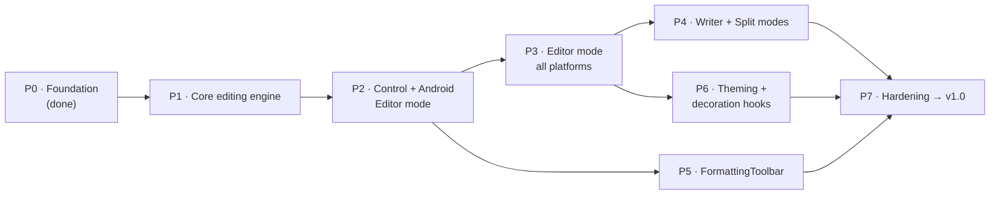

# CloudDown.Editor — Roadmap

|                  |                                                                                                             |
| ---------------- | ----------------------------------------------------------------------------------------------------------- |
| **Status**       | Draft                                                                                                       |
| **Owner**        | Brian Cupples                                                                                               |
| **Last updated** | 2026-06-09                                                                                                  |
| **Related**      | [Vision & Scope](vision.md) · [Architecture overview](architecture/overview.md) · [ADRs](architecture/adr/) |

> This roadmap sequences _how_ the [vision](vision.md) gets built. The vision is the source of
> truth for **what** is in and out of scope; this document orders that scope into a delivery plan
> and records current progress. When the two disagree, the vision wins and this document is corrected.

---

## 1. How to read this

- The plan is organized into **phases (P0–P7)** that lead to **v1.0**, then post-1.0 releases.
  Phases are **ordered by dependency, not by date** — each lists what it needs before it can
  start and what proves it done. This is a solo, pre-1.0 project; ordering is firm, timing is
  best-effort.
- A checked box (`✅` / `[x]`) means **built, tested, and on `main`** — not merely designed or
  started. Anything not yet on `main` is unchecked, however far along it is.
- Versioning follows **semver** ([Vision §8](vision.md#8-constraints)): no breaking changes in
  minor releases. The public API stabilizes at **1.0**; before then it may change.

## 2. Current status (2026-06-09)

**We are pre-1.0, finishing Foundation (P0) and starting the Core editing engine (P1).** The
repository, build, test harness, and project documentation exist; the editor control does **not**
yet exist.

| Area                       | State                                                                                                                                                |
| -------------------------- | ---------------------------------------------------------------------------------------------------------------------------------------------------- |
| Solution & build           | ✅ Multi-project layout builds across all platform TFMs; sample builds on Windows                                                                    |
| Core (UI-free)             | ⏳ `IMarkdownService` (`ToHtml`, `ApplyFormatting`); `EditorMode`/`EditorThemeMode`/`MarkdownFormat` enums; `EditorTheme`/`SyntaxColors` theme model |
| Test harness               | ✅ NUnit + Reqnroll + AwesomeAssertions wired; first specs green ([ADR-0002](architecture/adr/0002-test-stack.md))                                   |
| `MarkdownEditor`           | ❌ Not started — no cross-platform control, no bindable API                                                                                          |
| `FormattingToolbar`        | ❌ Not started                                                                                                                                       |
| Platform handlers          | ❌ Not started (Android / iOS / Windows / Mac Catalyst)                                                                                              |
| Theming & decoration hooks | ⏳ `EditorTheme`/`SyntaxColors` data model with Light/Dark presets exists; rendering & host hooks not started                                        |
| Docs (SDLC)                | ✅ Vision, ADRs 0001–0005, architecture overview, conventions, OSS health files                                                                      |

> **Note:** The [README](../README.md) now reflects this pre-1.0 status and links here; the
> roadmap remains the authoritative view of progress and sequencing.

## 3. Delivery plan → v1.0

The path from today to a shippable 1.0. Each phase is gated on the one(s) before it; the only
parallel track is the toolbar (P5), which needs the control (P2) but not the later modes.

### P0 — Foundation _(in progress)_

**Goal:** a building solution, a UI-free core boundary, and a fast test harness, all documented.

- [x] Solution scaffold, Central Package Management ([ADR-0004](architecture/adr/0004-central-package-management.md)), CI
- [x] Separate UI-free `CloudDown.Editor.Core` project ([ADR-0003](architecture/adr/0003-separate-core-project.md))
- [x] Test stack chosen and wired ([ADR-0002](architecture/adr/0002-test-stack.md))
- [x] Foundational documentation (vision, ADRs 0001–0005, architecture, conventions, OSS health files)
- [x] **P0-3** — Reconcile the README with the actual current state and link it to vision/roadmap

**Done when:** the repo's docs describe reality, and a contributor can build, test, and find their
way without reading the source.

### P1 — Core editing engine (UI-free)

**Goal:** every piece of editing logic that can exist without UI, fully specified and tested on
plain `net10.0`. This is the layer the handlers will lean on, so it lands first.

- [ ] Complete `ApplyFormatting` for **all 18 `MarkdownFormat` values** — insert, toggle-on,
      toggle-off/unwrap; empty selection, multi-line selection, idempotent round-trips
- [ ] **Syntax tokenizer** service — maps text → styled ranges (token kind + start/length) for
      handlers to render; token-kind based, themed via `SyntaxColors` (theme-agnostic output)
- [ ] **Undo/redo** history model — a UI-free command/edit stack
- [x] Theme model — `EditorTheme` / `SyntaxColors` / `EditorThemeMode`

**Depends on:** P0. **Done when:** Reqnroll behaviors + NUnit data-driven cases cover formatting,
tokenizing, and undo/redo; suite green; the project still references **no** `Microsoft.Maui.Controls`.

### P2 — `MarkdownEditor` control + Android (Editor mode)

**Goal:** the first real native editing surface, proving the handler architecture end-to-end on
one platform before fanning out.

- [ ] `MarkdownEditor` cross-platform `View`: bindable `Content` (two-way), `Mode`, `ThemeMode`,
      `Theme`, `ReadOnly`, `FontFamily`, `FontSize`, `ShowLineNumbers`; `ContentChanged` /
      `SelectionChanged` events
- [ ] Handler registration through `ConfigureCloudDownEditor`
- [ ] **Android handler** (`EditText` + `SpannableString`) consuming the P1 tokenizer + theme —
      **Editor mode** (syntax visible, highlighted); cursor/selection preserved across re-highlight
- [ ] Sample app page hosting a live editor instance

**Depends on:** P1. **Done when:** on Android you can type Markdown, see live highlighting, two-way
`Content` binding round-trips, and the cursor doesn't jump; Android handler specs green.

### P3 — Editor mode on all platforms

**Goal:** Editor-mode parity across the four MAUI heads, with parity enforced by shared specs.

- [ ] **Windows** handler — `RichEditBox`
- [ ] **iOS** handler — `UITextView` + `NSAttributedString`
- [ ] **Mac Catalyst** handler — `NSTextView`
- [ ] Shared Reqnroll behavior specs run against every platform handler

**Depends on:** P2. **Done when:** Editor mode behaves identically (per the shared specs) on
Android, iOS, Windows, and Mac Catalyst.

### P4 — Writer + Split modes

**Goal:** the remaining two editing modes from the vision, on all platforms.

- [ ] **Writer mode** — hide syntax markers, inline rich preview, per platform
- [ ] **Split mode** — editor + live HTML preview (`MarkdownService.ToHtml`) with synchronized scroll
- [ ] Mode switching preserves content and selection

**Depends on:** P3. **Done when:** all **three modes** work on **all four platforms**.

### P5 — FormattingToolbar

**Goal:** a toolbar control that drives formatting and mode switching. Runs in parallel with
P3/P4 once the control exists.

- [ ] `FormattingToolbar` bound to a `TargetEditor`; buttons map to `MarkdownFormat` actions and
      mode switches
- [ ] `ShowModeSwitch` / `ShowFormatButtons` / `Orientation` properties

**Depends on:** P2 (control + P1 formatting). **Done when:** the toolbar applies every formatting
action to the live selection and switches modes on every platform.

### P6 — Theming + decoration/annotation hooks

**Goal:** make theming visible and expose the host extensibility surface the vision promises.

- [ ] Wire `EditorTheme` / `EditorThemeMode` through the handlers (apply surface + syntax colors;
      `Auto` follows the system appearance)
- [ ] **Decoration / annotation API** — range-based, host-driven decorations (e.g. spell-check
      squiggles, highlights) rendered by handlers and raising interaction events
      ([Vision §5](vision.md#5-scope): _provide the hook, not the feature_)

**Depends on:** P3 (the rendering pipeline must exist). **Done when:** switching theme/mode
restyles the live editor, and a host can add/remove a decoration over a range and respond to
interaction — on every platform.

### P7 — Hardening → v1.0

**Goal:** production readiness. This phase _is_ the v1.0 definition of done.

- [ ] **Accessibility** pass per platform (screen reader / assistive technology)
- [ ] **Performance** — incremental parsing, debounced highlighting, large-doc virtualization;
      benchmark the provisional targets ([Vision §7](vision.md#7-success-criteria))
- [ ] **API docs** — XML doc comments on the public surface + a published API reference
- [ ] **Packaging** — single `CloudDown.Editor` NuGet bundling the Core DLL ([ADR-0003](architecture/adr/0003-separate-core-project.md))
- [ ] **Adoption** — CloudDown app consumes the package as its editor

**Depends on:** P4, P5, P6. **Done when:** the v1.0 checklist below is fully met.

### v1.0 — definition of done

A single place to confirm the release is ready (each item is delivered by the phase noted):

- [ ] Three modes on all four platforms (P3, P4)
- [ ] All four native handlers complete (P2, P3)
- [ ] `FormattingToolbar` with documented actions + mode switching (P5)
- [ ] Full MVVM / bindable API; no business logic in code-behind (P2)
- [ ] Theming (Light / Dark / Auto + custom syntax colors) and decoration hooks (P6)
- [ ] Accessibility, performance validated, API reference, NuGet packaging, CloudDown adoption (P7)

> Performance targets (real-time highlighting < 1,000 lines; < 100 ms at 1,000–10,000 lines) are
> **provisional** and validated in P7 before 1.0 is declared.

## 4. Beyond v1.0

### v1.1 — Authoring conveniences (planned)

- [ ] Table editing UI
- [ ] Image paste support
- [ ] Custom Markdig syntax extensions (public extension points)
- [ ] Export to PDF / HTML

### v2.0 — Extensibility & power features (future)

- [ ] Plugin system
- [ ] Language Server Protocol (LSP) support
- [ ] Advanced theming engine
- [ ] Split-pane customization (layout, ratios, synchronized-scroll options)

## 5. Under consideration (not committed)

Real candidates, deliberately **not** assigned to a release and **not** non-goals. Each graduates
into a phase only once its prerequisite is met.

| Candidate                 | Why it's parked                                                                                                                                    |
| ------------------------- | -------------------------------------------------------------------------------------------------------------------------------------------------- |
| Real-time collaboration   | Large surface (presence, conflict resolution); revisit once the single-user editor is stable at 1.0 ([Vision §5](vision.md#5-scope))               |
| **Linux / Tizen** support | Out of reach until .NET MAUI officially supports these heads; native handlers need a supported MAUI backend ([Vision §8](vision.md#8-constraints)) |

## 6. Out of scope

**Non-goals** for the library at any version — they belong to the host app. See
[Vision §5](vision.md#5-scope) for the full rationale.

- Cloud storage / sync
- File management (open / save / browse)
- Full word-processor features (spell-check, grammar, track-changes) — exposed via the P6
  decoration hooks for the host to build on, never implemented in the library.

## 7. Maintenance & change policy

- Reviewed when a phase completes or scope materially changes.
- A new architectural decision is captured as an [ADR](architecture/adr/) and linked here, not
  buried in this document.
- Scope is governed by the vision; if a candidate feature implies a scope change, update
  [vision.md](vision.md) first, then reflect it here.
